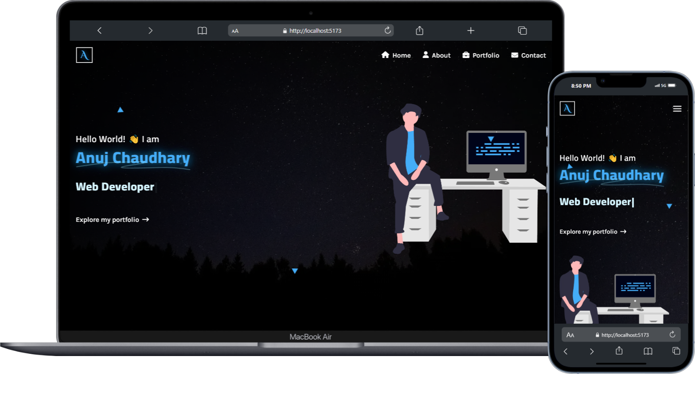

# 🌟 My Portfolio Website

Welcome to my portfolio website! This project showcases my skills and experience as a web developer. It features a variety of pages and functionalities to give you an insight into my work and expertise.

<div align="center">
  
</div>

## 🚀 Live Demo

You can view the live version of my portfolio website [here](https://anujchaudhary.netlify.app/).

## 🛠️ Technologies Used

- **HTML**
- **CSS**
- **Tailwind CSS**
- **React.js**
- **Material Tailwind**
- **Vite** (for development and build)

## ✨ Features

- **Responsive Design:** The website is designed to be responsive and work seamlessly across various devices.
- **Dynamic Pages:** Includes pages such as Home, About, Portfolio, and Contact.
- **Project Showcase:** Features a section to display recent projects with interactive elements.
- **Hero Sections:** Each page has a custom hero section with background images and animations.
- **Loader Animation:** A custom loader is shown during page transitions to enhance the user experience.
- **Not Found Page:** A custom 404 page is displayed for invalid URLs.

## 📷 Image Optimization

- **CDN Usage:** I'm using [Cloudinary](https://cloudinary.com/) for image delivery, which ensures faster loading times and optimized image formats.
- **Assets Management:** All assets used in the website are stored in the `assets` folder for easy management and organization.

## 🛠️ Installation

To run this project locally, follow these steps:

1. Clone the repository:

   ```bash
   git clone https://github.com/Anuj579/My-Portfolio.git

2. Navigate to the project directory:
   
   ```bash
   cd My-Portfolio

3. Install dependencies:

   ```bash
   npm install

4. Start the development server:

   ```bash
   npm run dev

